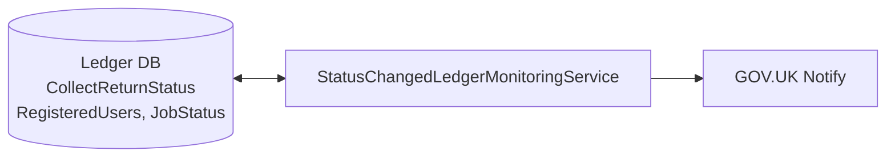

# SchoolAccount – Collect Notifications

A .NET 10 console app that watches the Census ledger for changes to a school's return status and emails the people 
registered for that school using GOV.UK Notify. It runs once and then exits, so it's designed to be triggered on a 
schedule, running on a Azure Container App Jobs.

## How it works

Each run does the following:

1. **Get the last run time.** Reads this job's row from the `JobStatus` table in the ledger database. If there
isn't one, it falls back to `1753-01-01` (the SQL Server minimum date).
2. **Find status changes.** Queries the `CollectReturnStatus` table in the ledger database, joined to 
`RegisteredUsers` so each change arrives already paired with the people to tell. For each school the latest row is 
compared with the row immediately before it, and it counts as changed if the `ReturnStatusCode` differs, or if there 
is no earlier row. Only changes where either end is Approved or Authorised are returned.
3. **Save the run time.** Writes the time this run started (UTC) back to `JobStatus`.
4. **Send emails.** Sends each notification through GOV.UK Notify using the `CensusStatusChange` template. A
problem with one recipient is logged and skipped; a rate limit or an authentication failure stops the run.



### GOV.UK Notify template

The template (`GovNotifyTemplates.CensusStatusChange`) is sent with these personalisation fields:

| Field         | Value                                                 |
|---------------|-------------------------------------------------------|
| `status`      | The new `ReturnStatusCode` (currently the raw number) |
| `school_name` | The school name from the ledger row                   |

## Configuration

Configuration uses the standard .NET host setup, so values can come from `appsettings.json`, environment variables or 
user secrets. Options marked as required are validated when the app starts, so it will fail fast if they are missing.

### Ledger database (required)

| Key                                | Description                                        |
|------------------------------------|----------------------------------------------------|
| `ConnectionStrings:LedgerDatabase` | SQL Server connection string for the Census ledger |

### GOV.UK Notify (required)

| Key                     | Required | Description |
| ----------------------- | -------- | ----------- |
| `GovNotify:ApiKey`      | Yes      | Notify API key. The sender address, reply-to and templates all come from the service this key belongs to |
| `GovNotify:DelayBetweenSendsInMs` | No | Pause between each send. Defaults to `0`. Nothing needs it at beta volumes, it's there to turn up if Notify starts rate limiting us |

### Azure App Configuration

Off unless switched on, so local runs and the tests don't reach for it. Deployed environments set
`Enabled` to `true` and take their settings from the store.

| Key                              | Description |
| -------------------------------- | ----------- |
| `AzureAppConfiguration:Enabled`  | `true` to load configuration from App Configuration. Anything else, including absent, leaves it off |
| `AzureAppConfiguration:Endpoint` | The store's endpoint. Required when `Enabled` is `true`, and startup fails without it |

Key Vault references in the store are resolved by the app rather than by App Configuration, so the
identity needs `Key Vault Secrets User` on the vault as well as `App Configuration Data Reader` on
the store.

### Census

All three are required. Each one fails quietly if it isn't set, so they're validated at startup.

| Key                      | Description |
| ------------------------ | ----------- |
| `Census:Collection`      | The collection to watch, matching the `Collection` column the ledger procedure writes, for example `SchoolCensus2025_Spring` |
| `Census:JobName`         | Names this job's row in the ledger's `JobStatus` table, where the last run date lives |
| `Census:AllowedStatuses` | The statuses that make a change notifiable at either end of the transition (`ReturnStatusCodes`) |

### Example `appsettings.Development.json`

```json
{
  "ConnectionStrings": {            // Required.
    "LedgerDatabase": ""            // Required. Connection string to the ledger db.
  },
  "GovNotify": {                    // Required.
    "ApiKey": ""                    // Required. Api from GovNotify.
  },
  "Census": {                       // Required.
    "AllowedStatuses": [],          // Required. The enum or int values of the ReturnStatueCodes which are allowed.
    "JobName": ""                   // Required. Names this job's row in the ledger JobStatus table.
  }
}
```

## Running locally

### Prerequisites

> Currently still investigating this as of 15 Sep 26.

#### Required

- [.NET 10 SDK](https://dotnet.microsoft.com/download)
- Access to a ledger database with the `CollectReturnStatus` table, see 
[SchoolAccount-CollectStateLedgerDatabase](https://github.com/DFE-Digital/SchoolAccount-CollectStateLedgerDatabase) for
a local setup.
- A GOV.UK Notify API key (use a **test** or **team** key when developing)

#### Optional
- Docker
- Using the [SchoolAccount-LocalDevTools](https://github.com/DFE-Digital/SchoolAccount-LocalDevTools) would benefit creating and managing your local db via Docker. This is 
needed to run the integration tests.

### Secrets

The project has user secrets enabled. Keep API keys and connection strings out of source control by setting them there:

```bash
dotnet user-secrets --project SchoolAccount.CollectNotifications set \"GovNotify:ApiKey\" \"<your-key>\"
dotnet user-secrets --project SchoolAccount.CollectNotifications set \"ConnectionStrings:LedgerDatabase\" \"<connection-string>\"
```

> User secrets are only loaded when the environment is `Development`. 

### Run

```bash
DOTNET_ENVIRONMENT=Development dotnet run --project SchoolAccount.CollectNotifications
```

> If you are using a run profile ensure you have `DOTNET_ENVIRONMENT=Development` set iwthin your enviroment variables.

## Testing

The solution is divided into three test projects:

- **`SchoolAccount.CollectNotifications.TestCommon`** is shared test fixtures, mock helpers, and fluent builders.
- **`SchoolAccount.CollectNotifications.UnitTests`** is for fast, isolated unit tests mocking external I/O and dependencies.
- **`SchoolAccount.CollectNotifications.IntegrationTests`** is the integration tests running against a local SQL Server Docker container (`localhost:1433`).

### Running tests

#### Prerequisites

- `xunit`
- `NSubsitute` for mocking dependencies and verifying interactions
- `Shouldly` which is a fluent assertion library

If you want to run the integration tests you will need a local database running, as a reminder this can be easily done 
via the [SchoolAccount-LocalDevTools](https://github.com/DFE-Digital/SchoolAccount-LocalDevTools) repo.

#### Run all tests across the solution:

```bash
dotnet test
```

#### Run only unit tests:
```bash
dotnet test SchoolAccount.CollectNotifications.UnitTests
```

#### Run only integration tests:
```bash
dotnet test SchoolAccount.CollectNotifications.IntegrationTests
```

#### In CI

The build workflow runs the whole solution, integration tests included. It starts SQL Server as a service container
and applies `database.sql` and `tables.sql` from
[SchoolAccount-CollectStateLedgerDatabase](https://github.com/DFE-Digital/SchoolAccount-CollectStateLedgerDatabase),
so a schema change that breaks these tests shows up on the next build here. `stored-procedures.sql` is left out: it
reads from COLLECTPortal, which this service never touches and CI does not have. It is pinned to the
`notification-tables` branch, because `RegisteredUsers` and `JobStatus` have not been merged to `main` there yet.
Once they are, drop `LEDGER_DATABASE_REF` from the workflow so it tracks the default branch.

### Test coverage

#### **Workflow Orchestration** by `StatusChangedLedgerMonitoringServiceTests`
- Validating end-to-end processing pipeline across the ledger queries and run tracking.
- Skipping invalid or incomplete recipient records.
- Matching changed schools to recipients and building notification payloads.
- Sending each notification through GOV.UK Notify, and what happens when one is rejected or the service fails.

#### **GOV.UK Notify Integration** by `GovNotifyServiceTests`
- Template personalisation and reply-to configuration.
- Error wrapping on Notify client failures.

#### **Run Tracking** by `LastRanServiceIntegrationTests`
- Reading and writing this job's row in `JobStatus`, including the never-run case and not adding a second row.
- Fallback to minimum SQL Server timestamp on initial runs.

#### **Test Data Builders** located in `Builders/`
- Fluent builder helpers to create clean, reusable test fixtures:
  - `CollectReturnStatusBuilder` to build a ledger row (`CensusStatusChange`);
  - `NotificationBuilder` to allow us to emulate sending a request to the GovNotify service.

#### **App Initialisation Tests** by `InitialisationTests`
  - `InitialisationTests.ServiceResolution.cs`: Host container bootstrapping, environment verification, and core service resolution.
  - `InitialisationTests.OptionsValidation.cs`: Fail-fast startup validation for required API keys, paths, and options binding.

#### **Ledger database integration+** by `LedgerStoreIntegrationTests`
  - `LedgerStoreIntegrationTests.WindowingAndBaselines.cs`: SQL Server windowing functions, initial baseline detection, previous baseline tracking, and unchanged return status filtering.
  - `LedgerStoreIntegrationTests.FilteringAndScenarios.cs`: Empty key handling, LAESTAB key filtering, approved status filtering, and multi-school mixed scenarios.


## Running & Consuming

### Rider / IDEs

You should be able to run this via a run profile which will be automatically built by your IDE.

### Docker

You can also do this via Docker by: Build from the repository root, as the Dockerfile expects the solution folder as its build context:

```bash
docker build -f SchoolAccount.CollectNotifications/Dockerfile -t schoolaccount-collect-notifications .

docker run --rm \
  -e ConnectionStrings__LedgerDatabase=\"<connection-string>\" \
  -e GovNotify__ApiKey=\"<your-key>\" \
  -v \"$(pwd)/data:/data:ro\" \
  schoolaccount-collect-notifications
```

## First run behaviour

When this job has no row in `JobStatus`, everything in the ledger counts as new, which would email every school
about every qualifying change it has ever had. So the first run doesn't send anything. It records the time it
started, logs a warning saying so, and exits. The run after that behaves normally.

There is no deployment step for this, but it does mean the first scheduled run after go-live is a no-op.

To deliberately notify from an earlier point, set the job's `LastRun` to that date and run again:

```sql
UPDATE JobStatus SET LastRun = '2026-09-01' WHERE Name = '<Census:JobName>';
```

Be careful with how far back you go. Every qualifying change since that date is notified, so a date before the
collection opened will mail a lot of schools at once.

The run date is stored in UTC, so the `UpdatedAt` values in the ledger are expected to be in UTC too.

## Project structure

```
SchoolAccount.CollectNotifications/
├── Extensions/        # Dependency injection and options setup
├── Interfaces/        # IDbConnectionFactory, IGovNotifyService, ILastRanService, ILedgerStore
├── Models/
│   ├── Databases/     # Marker types used to tell database connections apart
│   ├── Dtos/          # CensusStatusChange, Notification, NotificationResult
│   ├── Enums/         
│   ├── Options/       # Strongly typed configuration
│   └── Result.cs      # Result / Result<T> for handling errors without exceptions
├── Services/
│   ├── GovNotifyService.cs
│   ├── LastRanService.cs   # Last run time, in the ledger JobStatus table
│   ├── StatusChangedLedgerMonitoringService.cs  # Main workflow
├── Stores/
│   └── LedgerStore.cs # Status change query, joined to registered recipients
├── Dockerfile
└── Program.cs

SchoolAccount.CollectNotifications.TestCommon/
└── Builders/          # Fluent test object builders

SchoolAccount.CollectNotifications.UnitTests/
├── Extensions/        # Options and validation unit tests
├── Services/          # Unit tests for domain services
└── Stores/            # Unit tests for store operations and extension filters

SchoolAccount.CollectNotifications.IntegrationTests/
├── Helpers/           # Database test connection, schema seeding, and cleanup helpers
├── Initialisation/    # Host bootstrapping, DI resolution, and fail-fast validation tests
└── Stores/            # Integration tests against local Docker SQL Server instance
```

### Key packages

| Package | Used for |
| ------- | -------- |
| `Dapper` + `Microsoft.Data.SqlClient` | Querying SQL Server |
| `GovukNotify` | Sending emails |
| `Azure.Identity` | Authenticating to Azure App Configuration |

### Code Coverage

You can manually generate a test coverage report. Which files are included is
controlled by [coverage.config](coverage.config). To generate the same report locally, run 
[coverage.sh](coverage.sh) from the repository root:

```bash
./coverage.sh
```

The script runs all tests with coverage enabled, merges the per-project results with ReportGenerator, and writes an
HTML report to `TestResults/CoverageReport/index.html`. Pass `--open` to open the report in your browser when it
finishes:

```bash
./coverage.sh --open
```